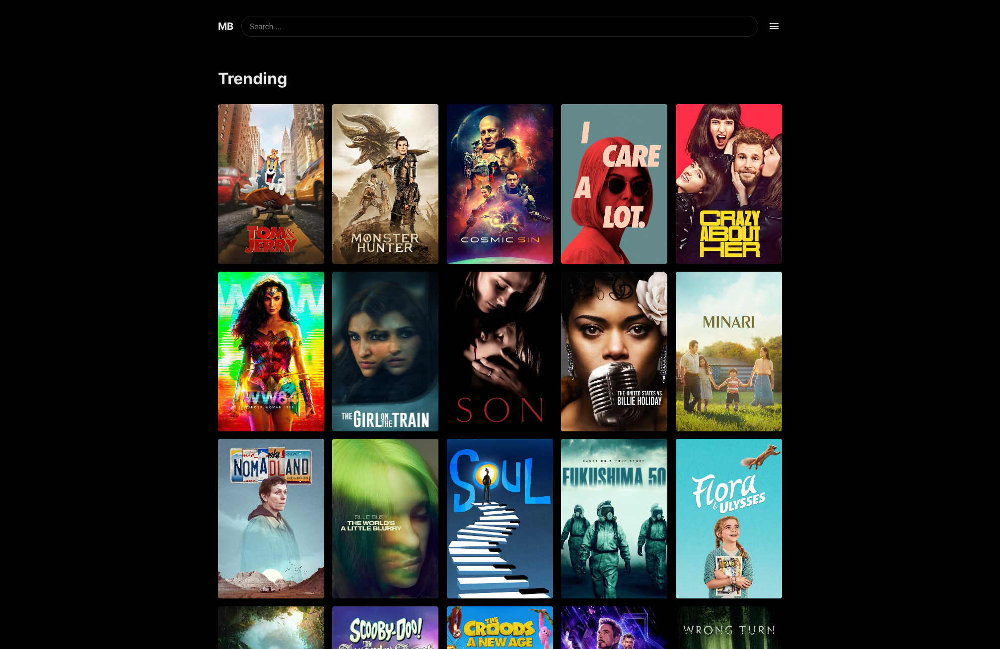
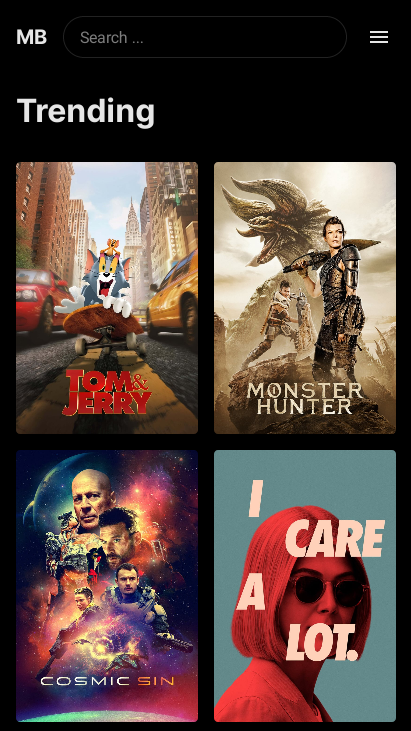
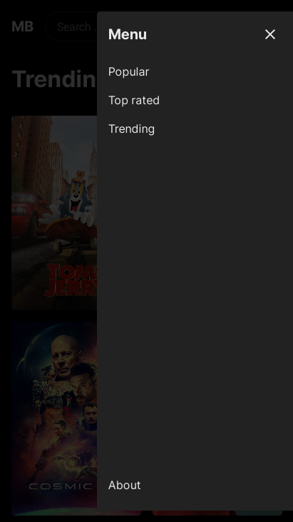
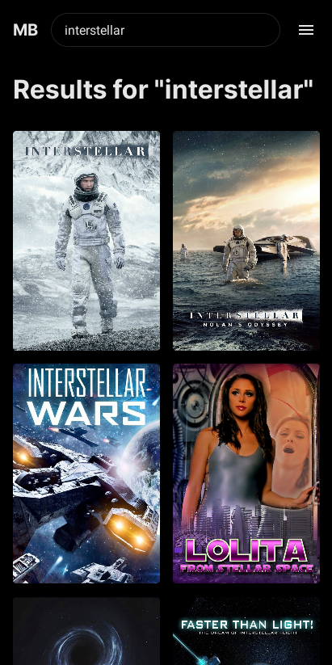
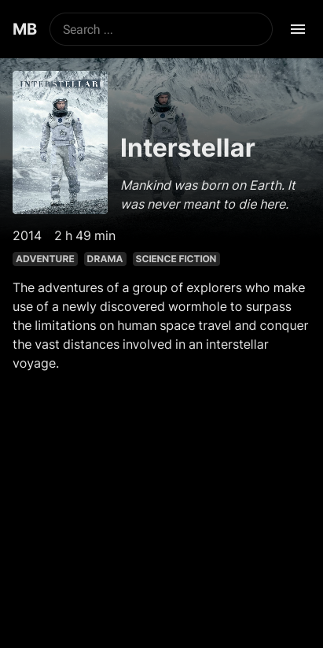

# Movie Browser

A React application for browsing movies.

## Screenshots

 
 

## Getting Started

### Prerequisites

- [Node.js](https://nodejs.org/)
- [Yarn](https://yarnpkg.com/)
- [TMDb](https://www.themoviedb.org/) API key

### Installation

1. Run `yarn` to install dependencies.
1. Fire up the application with `yarn start`.

   Make sure the environment variable `REACT_APP_TMDB_API_KEY` is defined and contains a valid TMDb
   API key.

## Built With

- [Create React App](https://create-react-app.dev/) &mdash; Easy and quick project setup
- [The TMDb API](https://developers.themoviedb.org/3/) &mdash; Movie data
- [React Query](https://github.com/tannerlinsley/react-query) &mdash; Hooks for fetching and managing asynchronous data
- [Theme UI](https://theme-ui.com/) &mdash; UI components / styling
- Quite a few other technologies

## License

This project is licensed under the MIT license.
